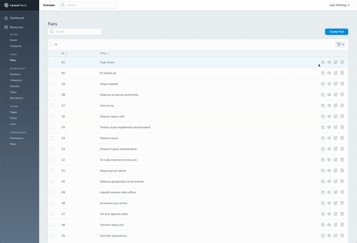

**v0.2.0**

# Nova Duplicate Field

Duplication of a record through the nova admin panel along with any defined relations that are required (tested on HasMany). Creates a copy of the data in our admin panel and redirects to the view.

### Todo

- [x] Duplicate relations alongside the main post.
- [ ] Catch errors properly
- [ ] Give a clearer notification to end users.

### Installation

Install the duplicate field.

```
composer require jackabox/nova-duplicate-field
```

Reference the duplicate field at the top of your Nova resource and then include the necessary code within the fields.

```php
use Jackabox\DuplicateField\DuplicateField
```

```php
DuplicateField::make('Duplicate')
    ->withMeta([
        'resource' => 'specialisms', // resource url
        'model' => 'App\Models\Specialism', // model path
        'id' => $this->id, // id of record
        'relations' => ['one', 'two'] // an array of any relations to load (nullable).
    ]),
```

Duplicate field only works on the index view and already passes through `onlyOnIndex()` as an option.

### Demo



## Issues

If there are any issues or requests feel free to open a GitHub issue or a pull request.
